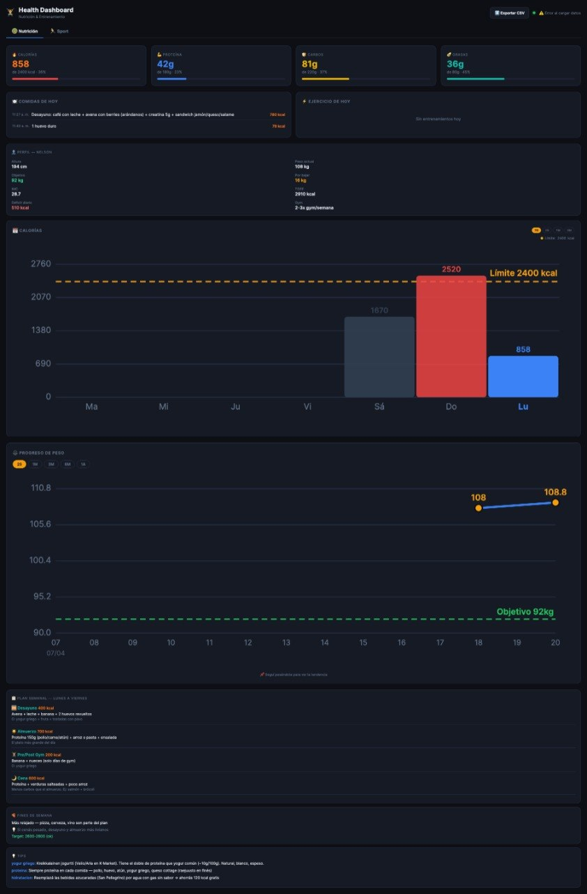

# 🏋️ Health Dashboard

A personal health tracking dashboard built with Python and vanilla JavaScript. Track your nutrition, workouts, and weight progress — all from a clean, dark-themed web interface.

## Features

### 🥗 Nutrition Tab
- **Photo-based calorie tracking** — send a meal photo via Telegram, AI analyzes it and logs calories + macros automatically
- **Daily macro breakdown** — calories, protein, carbs, and fat vs. your daily targets
- **Calorie chart** — visual bar chart with a daily limit line (red when exceeded)
- **Meal history** — timestamped log of everything you ate today
- **Meal plan** — personalized weekly eating guide with per-meal calorie targets

### 🏃 Sport Tab
- **Net calorie balance** — calories consumed minus calories burned, shown in real time
- **Workout log** — type, duration, calories burned per session
- **Weekly exercise chart** — bar chart of calories burned per day
- **Exercise plan** — weekly schedule with rest days and activity types

### ⚖️ Weight Progress
- **Weight log** — track your weight over time with date-stamped entries
- **Line chart** — smooth SVG line chart with goal weight line
- **Time window selector** — view 2 weeks, 1 month, 3 months, 6 months, or 1 year
- **Progress photos** — stored separately in `progress/` folder (not tracked by git)

### 👤 Profile
- Personal stats: age, height, current weight, goal weight
- Calculated BMR and TDEE
- Daily calorie deficit display

## Tech Stack

- **Backend**: Python 3 (stdlib only — no dependencies)
- **Frontend**: Vanilla HTML/CSS/JS with SVG charts
- **Storage**: JSON flat file
- **AI food analysis**: Gemini Vision API (via external assistant)
- **Server**: Pure Python HTTP server on port 3000

## Setup

```bash
git clone https://github.com/yourusername/health-dashboard.git
cd health-dashboard

# Start the server
python3 server.py 3000

# Open in browser
open http://localhost:3000
```

## Project Structure

```
health-dashboard/
├── server.py       # HTTP server with REST endpoints
├── index.html      # Single-page dashboard
├── data.json       # Your data (gitignored)
├── progress/       # Progress photos (gitignored)
└── README.md
```

## API Endpoints

| Method | Path | Description |
|--------|------|-------------|
| GET | `/` | Dashboard HTML |
| GET | `/health-data` | All data as JSON |
| POST | `/log-meal` | Log a meal |
| POST | `/log-workout` | Log a workout |
| POST | `/log-weight` | Log weight measurement |
| GET | `/export-csv` | Export meal history as CSV |

### Log a meal
```json
POST /log-meal
{
  "meal": "Chicken with rice and salad",
  "calories": 650,
  "protein": 45,
  "carbs": 60,
  "fat": 15,
  "timestamp": 1713600000
}
```

### Log a workout
```json
POST /log-workout
{
  "type": "Running",
  "duration_min": 45,
  "calories_burned": 500,
  "notes": "10km easy pace",
  "timestamp": 1713600000
}
```

## Screenshots

<!-- Add screenshot here -->


## License

MIT — personal use, fork freely.
